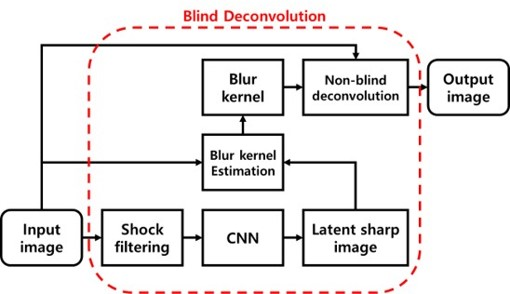

# Project_DeblurCNNv0.2
Minso Jeong, IPIU 특집호 (2018. 03 ~ 2018. 08)

> [**Uniform Motion Deblurring using Shock Filter and Convolutional Neural Network**](http://koreascience.or.kr/article/JAKO201824753344146.pdf)    
> Minso Jeong,  
> The Korean Institute of Broadcast and Media Engineers

Contact : [minso.jeong@daum.net](mailto:minso.jeong@daum.net)

## Updates

## Abstract
The uniform motion blur removing algorithm of Cho et al. has the problem in that the edge region of the image cannot be restored clearly. We propose the effective algorithm to overcome this problem by using shock filter that reconstructs a blurred step signal into a sharp edge, and convolutional neural network (CNN) that learns by extracting features from the image. Then uniform motion blur kernel is estimated from the latent sharp image to remove blur in the image. Proposed algorithm improves the disadvantages of the conventional algorithm by reconstructing the latent sharp image using shock filter and convolutional neural network. Through the experimental results, it was confirmed that the proposed algorithm shows excellent reconstruction performance in objective and subjective assessment than the conventional algorithm.

## Result
* PSNR (dB)

|Test Image |Width * Height |Test Image |Conventional |Ours|
|:-------------------:|:----------------:|:----------------:|:----------------:|:----------------:|
|Lighthouse |924×668|31.02|31.77|**32.77**|
|Building |924×616|22.68|24.08|**25.46**|
|Field |924×668|30.89|31.34|**31.62**|
|Bedroom |924×583|28.38|29.13|**32.58**|
|Cockpit |924×583|23.30|23.34|**25.10**|
|Desert |924×583|28.33|28.60|**30.06**|
|Temple |924×632|26.67|26.67|**29.03**|
|Warehouse |924×581|22.28|23.67|**25.13**|

* SSIM

|Test Image |Width * Height |Test Image |Conventional |Ours|
|:-------------------:|:----------------:|:----------------:|:----------------:|:----------------:|
|Lighthouse |924×668|0.83|0.91|**0.93**|
|Building |924×616|0.68|0.77|**0.80**|
|Field |924×668|0.74|0.79|**0.82**|
|Bedroom |924×583|0.82|0.89|**0.93**|
|Cockpit |924×583|0.62|0.69|**0.73**|
|Desert |924×583|0.77|0.84|**0.86**|
|Temple |924×632|0.71|0.75|**0.79**|
|Warehouse |924×581|0.58|0.69|**0.74**|

## Installation
Comming Soon!

## License
A large part of the code is borrowed from [A Neural Approach to Blind Motion Deblurring](https://projects.ayanc.org/ndeblur/). Thanks for providing.

## Citation